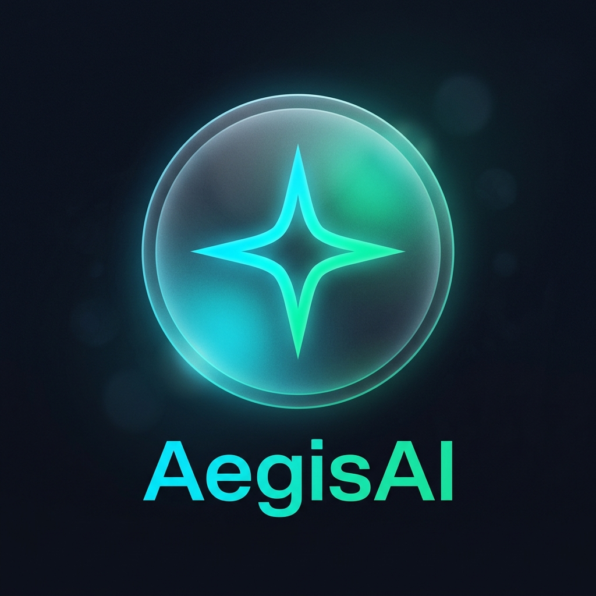

<div align="center">
  
  
  # 🛡️ AegisAI
  ### AI-Powered Support Intelligence Platform
  
  <p>
    <a href="#features" style="text-decoration: none; margin: 0 12px;">
      <span style="display: inline-block; padding: 8px 16px; background: linear-gradient(135deg, #667eea 0%, #764ba2 100%); color: white; border-radius: 20px; font-weight: 600; transition: all 0.3s ease; cursor: pointer;" onmouseover="this.style.transform='translateY(-2px)'; this.style.boxShadow='0 8px 16px rgba(102, 126, 234, 0.4)'" onmouseout="this.style.transform='translateY(0)'; this.style.boxShadow='none'">✨ Features</span>
    </a>
    <a href="#quick-start" style="text-decoration: none; margin: 0 12px;">
      <span style="display: inline-block; padding: 8px 16px; background: linear-gradient(135deg, #f093fb 0%, #f5576c 100%); color: white; border-radius: 20px; font-weight: 600; transition: all 0.3s ease; cursor: pointer;" onmouseover="this.style.transform='translateY(-2px)'; this.style.boxShadow='0 8px 16px rgba(245, 87, 108, 0.4)'" onmouseout="this.style.transform='translateY(0)'; this.style.boxShadow='none'">🚀 Start</span>
    </a>
    <a href="#tech-stack" style="text-decoration: none; margin: 0 12px;">
      <span style="display: inline-block; padding: 8px 16px; background: linear-gradient(135deg, #4facfe 0%, #00f2fe 100%); color: white; border-radius: 20px; font-weight: 600; transition: all 0.3s ease; cursor: pointer;" onmouseover="this.style.transform='translateY(-2px)'; this.style.boxShadow='0 8px 16px rgba(79, 172, 254, 0.4)'" onmouseout="this.style.transform='translateY(0)'; this.style.boxShadow='none'">⚙️ Tech</span>
    </a>
  </p>
</div>

---

## 🎯 About

**AegisAI** transforms support operations by clustering related tickets into **Master Incidents** using AI-powered pattern detection. Resolve hundreds of tickets with a single action.

<div id="features">

## ✨ Key Features

| Icon | Feature | Description |
|------|---------|-------------|
| 🧠 | **AI Clustering** | Real-time pattern detection groups related tickets into Master Incidents |
| ⚡ | **Resilient** | Smart caching & optimistic UI for seamless AWS connectivity handling |
| 🎭 | **Sentiment Analysis** | Amazon Comprehend integration detects frustration & auto-escalates |
| 📍 | **Smart Routing** | Intelligent agent assignment based on AI classification |
| 💎 | **Modern UI** | Glassmorphism design with smooth animations & real-time insights |

</div>

<div id="tech-stack">

## ⚙️ Tech Stack

```
Frontend    → React 19 • Vite • Lucide • Recharts
Backend     → Node.js • Express • DynamoDB
AI/ML       → Amazon Bedrock • Amazon Comprehend
Infrastructure → AWS SDK v3
```

</div>

<div id="quick-start">

## 🚀 Quick Start

**Prerequisites:** Node.js 18+, AWS Credentials

```bash
# 1. Install
npm install

# 2. Configure .env
AWS_REGION=ca-central-1
BEDROCK_MODEL_ID=us.amazon.nova-2-lite-v1:0
PORT=3001

# 3. Run
npm run dev      # Frontend
npm run server   # Backend
```

</div>

---

<div align="center" style="margin-top: 40px; padding: 20px; background: linear-gradient(135deg, rgba(102, 126, 234, 0.1) 0%, rgba(245, 87, 108, 0.1) 100%); border-radius: 12px; border: 1px solid rgba(102, 126, 234, 0.2);">
  <p style="font-size: 14px; color: #666; margin: 0;">
    Built with <span style="color: #f5576c; animation: pulse 1.5s infinite;">❤️</span> for modern support teams
  </p>
</div>

<style>
@keyframes pulse {
  0%, 100% { opacity: 1; }
  50% { opacity: 0.6; }
}
</style>
